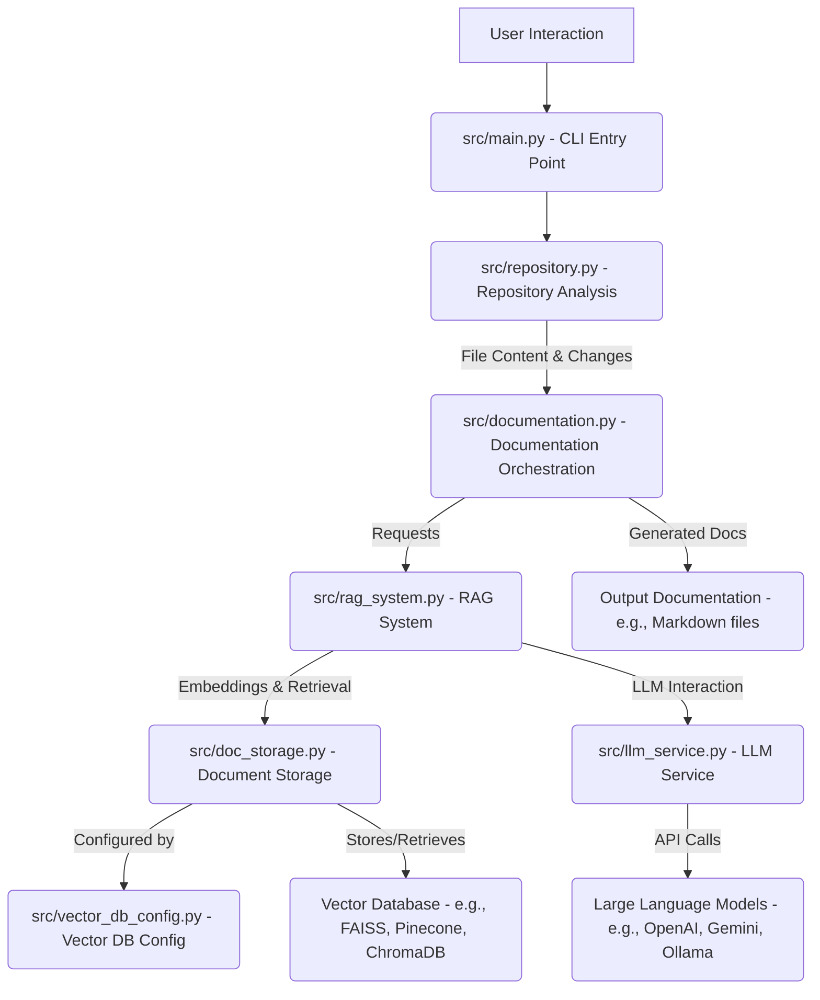

# Repository Documentation

**Generated: 2025-07-23 10:24:05**

## Table of Contents

- [Root](#{''.join(dir_name.lower().split())})
  - [_overview](#_overview)
  - [_section_ai_&_language_model_integration](#_section_ai_&_language_model_integration)
  - [_section_core_application_&_cli](#_section_core_application_&_cli)
  - [_section_data_persistence_&_vector_database_management](#_section_data_persistence_&_vector_database_management)
  - [_section_repository_interaction_&_analysis](#_section_repository_interaction_&_analysis)

## Root

### _overview

# Project Overview

Chronicler is a sophisticated command-line interface (CLI) tool designed to automate the generation and updating of technical documentation for GitHub repositories. It leverages advanced AI capabilities, specifically Large Language Models (LLMs) and Retrieval-Augmented Generation (RAG) systems, to analyze codebase structure, file contents, and commit history to produce comprehensive and up-to-date project documentation.

## 1. Project Purpose and Main Functionality

The primary purpose of Chronicler is to streamline the documentation process for software projects hosted on GitHub. It aims to provide an intelligent solution for maintaining accurate and current project overviews, file-level explanations, and architectural descriptions.

Its main functionalities include:

*   **Initial Documentation Generation (`create` command):** Analyzes a given GitHub repository from scratch, processing its files and structure to generate a complete set of documentation.
*   **Documentation Updates (`update` command):** Identifies changes based on Git commit history and intelligently updates existing documentation to reflect the latest modifications in the codebase.

## 2. Installation

This section outlines the necessary steps to set up and run Chronicler.

### Prerequisites

*   **Python:** Python 3.x is required.
*   **Git:** Git must be installed and accessible in your system's PATH for repository analysis.

### Step-by-Step Installation Instructions

1.  **Clone the Repository:**
    First, clone the Chronicler project repository to your local machine:
    ```bash
    git clone <repository_url>
    cd <repository_name>
    ```
    (Replace `<repository_url>` and `<repository_name>` with the actual values if known, otherwise assume the current directory is the project root.)

2.  **Create a Virtual Environment (Recommended):**
    It is highly recommended to create a Python virtual environment to manage dependencies:
    ```bash
    python -m venv venv
    ```

3.  **Activate the Virtual Environment:**
    *   **On macOS/Linux:**
        ```bash
        source venv/bin/activate
        ```
    *   **On Windows:**
        ```bash
        .\venv\Scripts\activate
        ```

4.  **Install Dependencies:**
    Install all required Python packages using pip:
    ```bash
    pip install -r requirements.txt
    ```
    For locked dependencies, use:
    ```bash
    pip install -r requirements.lock
    ```

### Environment Setup Requirements

Chronicler relies on environment variables for configuration, particularly for integrating with Large Language Models and external Vector Databases.

1.  **Create a `.env` file:**
    Copy the provided `.env.example` file to `.env` in the project root directory:
    ```bash
    cp .env.example .env
    ```

2.  **Configure Environment Variables:**
    Edit the newly created `.env` file and populate it with the necessary API keys and configuration details for your chosen LLM provider (e.g., OpenAI, Google Gemini, Ollama) and any external vector database (e.g., Pinecone, Weaviate, Qdrant, Milvus) you intend to use. Specific variables will be detailed within the `.env.example` file.

## 3. Usage

Chronicler is operated via its command-line interface, powered by Typer.

### Basic Command Syntax

The general syntax for running Chronicler commands is:

```bash
python src/main.py <command> [options]
```

### Available Commands and Their Purposes

Chronicler provides two primary commands:

*   **`create`**:
    *   **Purpose:** Generates documentation for a GitHub repository from scratch. This command performs a full analysis of the repository's files and structure to produce initial documentation.
    *   **Example:**
        ```bash
        python src/main.py create
        ```

*   **`update`**:
    *   **Purpose:** Updates existing documentation based on recent Git commit changes in the repository. This command intelligently identifies modified files and updates only the relevant sections of the documentation.
    *   **Example:**
        ```bash
        python src/main.py update
        ```

### Important Command-Line Options

While specific options are not detailed in the provided information, Typer-based CLIs typically support various flags and arguments for customization (e.g., specifying repository path, output directory, LLM model, etc.). Users should consult the tool's help output (`python src/main.py --help` or `python src/main.py <command> --help`) for a comprehensive list of available options.

## 4. Architecture Overview

Chronicler's architecture is modular, designed around a core set of components that interact to perform repository analysis, documentation generation, and storage.



### Component Relationships:

*   **`src/main.py`**: Serves as the central entry point for the application, parsing user commands (`create`, `update`) and orchestrating the execution flow by invoking other core modules.
*   **`src/repository.py`**: Responsible for interacting with the target GitHub repository. It handles tasks such as cloning, reading file contents, analyzing repository structure, and detecting changes via Git commit history.
*   **`src/documentation.py`**: Acts as the orchestrator for the documentation generation process. It coordinates the retrieval of repository data, the processing by the RAG system, and the final output formatting.
*   **`src/llm_service.py`**: Provides an abstraction layer for interacting with various Large Language Models. It manages API calls to LLM providers (e.g., OpenAI, Google Gemini, Ollama) and handles model-specific configurations.
*   **`src/rag_system.py`**: Implements the Retrieval-Augmented Generation logic. It queries the document storage for relevant context, combines it with the current input (e.g., code snippets, commit messages), and prompts the LLM service to generate contextually rich documentation.
*   **`src/doc_storage.py`**: Manages the storage and retrieval of processed documentation chunks and their embeddings. It interfaces with various vector databases to store and efficiently query documentation data.
*   **`src/vector_db_config.py`**: Contains logic and configurations for connecting to and managing different vector database implementations (e.g., FAISS, Pinecone, Weaviate, ChromaDB, Qdrant, Milvus).
*   **`VECTOR_DB_CONFIG.md`**: Provides external documentation or configuration guidelines related to setting up and using vector databases with Chronicler.

## 5. Key Workflows and Processes

Chronicler's two main commands, `create` and `update`, follow distinct but related workflows.

### `create` Workflow (Initial Documentation Generation)

1.  **Repository Analysis:** The `main.py` script initiates `repository.py` to analyze the entire target GitHub repository. This involves recursively listing files, reading their content, and understanding the project structure.
2.  **Content Processing:** The raw file content is then passed to `documentation.py`, which likely prepares it for embedding (e.g., chunking large files).
3.  **Embedding and Storage:** `doc_storage.py` takes the processed content, generates vector embeddings for each chunk (using a sentence transformer or similar model), and stores these embeddings along with their corresponding text in the configured vector database (e.g., FAISS, Pinecone).
4.  **Documentation Generation (RAG):** For each relevant file or section, `rag_system.py` queries the vector database for contextually similar information. It then uses `llm_service.py` to prompt an LLM, providing the code content and retrieved context, to generate descriptive documentation.
5.  **Output Generation:** `documentation.py` collects the generated text, formats it (e.g., into Markdown), and saves it to the designated output location within the repository.

### `update` Workflow (Documentation Update)

1.  **Change Detection:** The `main.py` script invokes `repository.py` to identify changes in the GitHub repository since the last documentation generation. This typically involves analyzing Git commit history to pinpoint modified, added, or deleted files.
2.  **Targeted Processing:** For each identified change:
    *   **Modified Files:** `repository.py` provides the updated content. `rag_system.py` retrieves existing documentation and relevant context from `doc_storage.py`. `llm_service.py` is then used to generate updated documentation sections based on the changes, ensuring consistency with existing content.
    *   **New Files:** These are processed similarly to the `create` workflow, generating new documentation entries.
    *   **Deleted Files:** Corresponding documentation entries are identified and removed or marked as obsolete.
3.  **Vector Database Update:** `doc_storage.py` updates the vector database by adding new embeddings, modifying existing ones, or removing obsolete entries.
4.  **Documentation Output Update:** `documentation.py` integrates the newly generated or modified documentation into the existing documentation structure, ensuring the output remains current.

## 6. Technology Stack

Chronicler is built upon a robust set of Python libraries and frameworks, leveraging modern AI and data management technologies.

*   **Programming Language:** Python 3.x
*   **Command-Line Interface (CLI):**
    *   `typer`: For building intuitive and robust command-line applications.
    *   `rich`: For rich text and beautiful formatting in the terminal.
*   **Large Language Model (LLM) Integration:**
    *   `langchain`: A framework for developing applications powered by language models.
    *   `langchain-openai`: Integration with OpenAI's LLMs.
    *   `langchain-ollama`: Integration with Ollama for local LLMs.
    *   `langchain-google-genai`: Integration with Google Gemini LLMs.
    *   `openai`: Direct client for OpenAI API.
*   **Vector Databases (Configurable):**
    *   `faiss-cpu`: For efficient similarity search and local vector storage.
    *   `pinecone-client`: For Pinecone cloud-native vector database.
    *   `weaviate-client`: For Weaviate vector database.
    *   `chromaddb`: For ChromaDB vector database.
    *   `qdrant-client`: For Qdrant vector database.
    *   `pymilvus`: For Milvus vector database.
*   **Repository Interaction:**
    *   `gitpython`: For programmatic interaction with Git repositories.
*   **Data Processing and Utilities:**
    *   `numpy`: For numerical operations, especially with embeddings.
    *   `pandas`: For data manipulation and analysis.
    *   `tiktoken`: For tokenization with OpenAI models.
    *   `python-dotenv`: For managing environment variables.
    *   `PyYAML`: For parsing YAML configuration files.
    *   `sentence-transformers`: For generating embeddings from text.
    *   `cydifflib`: For efficient diffing operations.
    *   `pygments`: For syntax highlighting in code snippets.
*   **Testing:**
    *   `pytest`: For unit and integration testing.

### _section_ai_&_language_model_integration

This section, "AI & Language Model Integration," forms the intelligent core of the Chronicler application, responsible for interacting with large language models (LLMs) and leveraging them to generate comprehensive and contextually rich documentation. It comprises two key components: `src/llm_service.py`, which provides a unified interface for various LLM providers, and `src/rag_system.py`, which implements a Retrieval-Augmented Generation (RAG) system to enhance the LLM's knowledge with specific codebase context.

### 1. LLM Service (`src/llm_service.py`)

The `llm_service.py` file defines the `LLMService` class, acting as an abstraction layer for all interactions with language models and embedding models. Its primary role is to centralize the configuration, initialization, and usage of different LLM and embedding providers, ensuring that the rest of the application can communicate with these models through a consistent interface, regardless of the underlying technology.

**Key Functionality and Features:**

*   **Provider Agnostic Interface**: `LLMService` supports multiple LLM and embedding providers, including:
    *   **OpenAI**: Via `langchain_openai.ChatOpenAI` and `OpenAIEmbeddings`.
    *   **Google Gemini**: Via `langchain_google_genai.ChatGoogleGenerativeAI` and `GoogleGenerativeAIEmbeddings` (conditionally available based on package installation).
    *   **Ollama**: For local LLMs and embeddings, via `langchain_ollama.ChatOllama` and `OllamaEmbeddings`.
    *   **Local HuggingFace Embeddings**: For local embedding generation, via `langchain_community.embeddings.HuggingFaceEmbeddings`.
*   **Flexible Configuration**: The service can be configured during initialization with specific `llm_provider`, `embedding_provider`, `llm_model_name`, `embedding_model_name`, and `temperature`. If not provided, it intelligently falls back to environment variables (`LLM_PROVIDER`, `EMBEDDING_PROVIDER`, `LLM_MODEL`, `EMBEDDING_MODEL`) for seamless deployment and configuration management.
*   **Core LLM Operations**:
    *   `get_llm()`: Returns the initialized chat model instance.
    *   `get_embedding_model()`: Returns the initialized embedding model instance.
    *   `generate_response(prompt_template, **kwargs)`: Orchestrates the LLM call, taking a `ChatPromptTemplate` and input variables to generate a coherent response. It handles the nuances of extracting content from different model response formats.
    *   `generate_embeddings(texts: List[str])`: Generates vector embeddings for a list of text strings using the configured embedding model.

**Configuration and Dependencies:**

The `LLMService` relies on environment variables for API keys and model names (e.g., `OPENAI_API_KEY`, `GOOGLE_API_KEY`, `OLLAMA_BASE_URL`). It leverages the `langchain` library extensively for its integrations with various LLM providers and prompt templating.

### 2. RAG System (`src/rag_system.py`)

The `rag_system.py` file implements the `RAGSystem` class, which is crucial for enhancing the quality and relevance of generated documentation. It achieves this by building a contextual knowledge base from the codebase and retrieving relevant information to augment the LLM's prompts. This ensures that the LLM has access to specific, up-to-date details from the project's files when generating explanations.

**Key Functionality and Features:**

*   **Knowledge Base Construction**:
    *   `build_knowledge_base()`: This is the primary method for ingesting repository content. It prioritizes processing the `README.md` file, then iterates through all other files indexed by the `Repository` object.
    *   `_process_document(file_path, content)`: For each file, this method cleans the content (e.g., removing comments, docstrings, or markdown formatting based on file type) and then uses `RecursiveCharacterTextSplitter` to break down the content into smaller, manageable chunks (`Document` objects).
    *   `_create_vector_store()`: After processing all documents, this method uses the `LLMService`'s embedding model to convert the text chunks into numerical vectors. These vectors are then stored in a FAISS in-memory vector database, enabling efficient similarity searches.
*   **Context Retrieval**:
    *   `retrieve_context(query: str, k: int = 4)`: Given a user query or a prompt, this method uses the `LLMService` to embed the query. It then performs a similarity search against the FAISS vector store to find the `k` most relevant document chunks from the codebase. These retrieved chunks serve as contextual information for the LLM.
*   **Content Pre-processing**: Includes specialized methods like `_process_python_file()` and `_process_markdown_file()` to clean and prepare content specific to different file types, ensuring that only relevant information is chunked and embedded.

**Dependencies and Interactions:**

The `RAGSystem` has a critical dependency on the `LLMService` for both generating embeddings during knowledge base construction and for embedding queries during context retrieval. It also relies heavily on the `Repository` class (See [Repository Interaction & Analysis] for details) to access and read the contents of the codebase files. The `langchain` library is used for text splitting (`RecursiveCharacterTextSplitter`) and vector store management (`FAISS`).

### 3. System Interaction and Data Flow

The `LLMService` and `RAGSystem` work in tandem to provide intelligent documentation generation:

1.  **Initialization**: The main application (See [Core Application & CLI] for details) first initializes an `LLMService` instance, configuring it with the desired LLM and embedding providers and models.
2.  **Knowledge Base Building**: An instance of `RAGSystem` is then created, taking the initialized `LLMService` and a `Repository` object as arguments. The `RAGSystem` calls `build_knowledge_base()`, which:
    *   Retrieves file content from the `Repository`.
    *   Cleans and chunks the content into `Document` objects.
    *   Passes these `Document` objects to the `LLMService`'s `generate_embeddings()` method to convert them into vectors.
    *   Stores these vectors in a FAISS vector store.
3.  **Contextual Retrieval**: When the application needs to generate documentation for a specific part of the codebase or answer a query, it calls `RAGSystem.retrieve_context()` with the relevant query.
    *   The `RAGSystem` uses `LLMService` to embed this query.
    *   It then queries its FAISS vector store to find the most semantically similar code snippets or documentation chunks.
4.  **Augmented Generation**: The retrieved context (code snippets, documentation) is then combined with a specific prompt template and passed to the `LLMService.generate_response()` method. This allows the LLM to generate highly relevant and accurate documentation, grounded in the actual codebase.

This architecture ensures that the LLM's responses are not generic but are specifically tailored to the project's unique context, significantly improving the quality and utility of the generated documentation.

### 4. Architectural Patterns

*   **Service Abstraction**: `LLMService` exemplifies the Service Abstraction pattern, providing a clean, consistent API for interacting with diverse external LLM and embedding providers. This decouples the core application logic from the specifics of each provider, making the system more modular and extensible.
*   **Retrieval-Augmented Generation (RAG)**: The `RAGSystem` implements the RAG pattern, which is a powerful technique for grounding LLM responses in specific, external knowledge. By retrieving relevant information from the codebase and providing it as context to the LLM, the system mitigates issues like hallucination and ensures factual accuracy.
*   **Dependency Injection**: Both `LLMService` and `RAGSystem` are designed to be initialized with their dependencies (e.g., `Repository` and `LLMService` itself for `RAGSystem`), promoting loose coupling and testability.

### 5. Configuration and Setup Requirements

To utilize the AI and Language Model Integration, the following environment variables should be configured:

*   `LLM_PROVIDER`: Specifies the LLM provider (e.g., `openai`, `gemini`, `ollama`).
*   `LLM_MODEL`: Specifies the name of the LLM model (e.g., `gpt-4o`, `gemini-pro`, `llama3`).
*   `EMBEDDING_PROVIDER`: Specifies the embedding provider (e.g., `openai`, `gemini`, `ollama`, `local`).
*   `EMBEDDING_MODEL`: Specifies the name of the embedding model (e.g., `text-embedding-ada-002`, `nomic-embed-text`, `all-MiniLM-L6-v2`).

Additionally, API keys for commercial providers must be set:

*   `OPENAI_API_KEY`: Required if `LLM_PROVIDER` or `EMBEDDING_PROVIDER` is `openai`.
*   `GOOGLE_API_KEY`: Required if `LLM_PROVIDER` or `EMBEDDING_PROVIDER` is `gemini`.

For `ollama` providers, `OLLAMA_BASE_URL` might need to be set if Ollama is not running on the default host/port. Local embedding models (e.g., `HuggingFaceEmbeddings`) do not require external API keys but may require downloading model weights locally on first use.

This comprehensive integration of LLM services and a RAG system empowers Chronicler to generate highly accurate, context-aware, and valuable documentation directly from the source code.

### _section_core_application_&_cli

This section, "Core Application & CLI," forms the central nervous system of Chronicler, encompassing the command-line interface (CLI) and the core logic responsible for orchestrating the documentation generation process. It primarily involves two key files: `src/main.py`, which serves as the application's entry point and CLI handler, and `src/documentation.py`, which encapsulates the sophisticated logic for analyzing codebases and generating comprehensive documentation.

Together, these files provide the user-facing interface and the underlying machinery that coordinates various components to transform a GitHub repository into structured documentation.

### 1. `src/main.py`: The Application Orchestrator

`src/main.py` is the heart of the Chronicler application, acting as the primary interface for users and the orchestrator that brings all other system components together. It leverages the [Typer](https://typer.tiangolo.com/) framework to define a robust and user-friendly command-line interface.

**Key Responsibilities:**

*   **CLI Definition**: It initializes a `typer.Typer` application, defining the main commands available to the user, such as `create` (for generating documentation from scratch) and `update` (for updating existing documentation based on Git changes).
*   **Parameter Handling**: It parses and validates command-line arguments, including the repository URL or local path, output directory, API keys, and specific configurations for Large Language Models (LLMs) and embedding providers/models.
*   **Component Initialization**: Crucially, `main.py` is responsible for instantiating and configuring the core services required for documentation generation. This includes:
    *   `Repository`: Manages interactions with the target GitHub repository (See [Repository Interaction & Analysis] for details).
    *   `LLMService`: Provides an abstraction layer for interacting with various LLM providers (e.g., OpenAI, Gemini, Ollama) (See [AI & Language Model Integration] for details).
    *   `RAGSystem`: Handles the Retrieval-Augmented Generation process, building a knowledge base from the repository and retrieving relevant context (See [AI & Language Model Integration] and [Data Persistence & Vector Database Management] for details).
    *   `DocumentationGenerator`: The core logic component for generating the documentation itself, discussed in the next section.
*   **Configuration Management**: It utilizes `python-dotenv` (`load_dotenv()`) to load environment variables, allowing users to configure default LLM providers, models, and API keys without specifying them on the command line every time. Command-line arguments take precedence over environment variables.
*   **Execution Flow**: Once all components are initialized and configured based on user input and environment variables, `main.py` dispatches the execution to the appropriate command handler (e.g., `create` or `update`), which then orchestrates the documentation generation process by interacting with the `DocumentationGenerator` instance.

### 2. `src/documentation.py`: The Documentation Generation Engine

The `src/documentation.py` file houses the `DocumentationGenerator` class, which is the central engine for analyzing code, retrieving context, and generating the actual documentation content. It acts as the primary consumer of the services initialized by `main.py`.

**Key Responsibilities and Interactions:**

*   **Initialization and Dependencies**: The `DocumentationGenerator` is designed with dependency injection, receiving instances of `Repository`, `RAGSystem`, and `LLMService` during its initialization. This design pattern ensures loose coupling and makes the class highly testable and modular.
    ```python
    class DocumentationGenerator:
        def __init__(self, repository: Repository, rag_system: RAGSystem, llm_service: LLMService, output_dir: Optional[Path] = None):
            self.repository = repository
            self.rag_system = rag_system
            self.llm_service = llm_service
            # ...
    ```
    This clearly illustrates how `main.py` (the orchestrator) provides the necessary tools to `DocumentationGenerator`.
*   **Output Management**: It manages the creation of the output directory structure for the generated documentation. It automatically creates a timestamped folder within a `docs/` directory (relative to the current working directory) to store documentation, ensuring that multiple runs do not overwrite previous outputs and that documentation is consistently saved. The repository name is also incorporated into the output path for clarity.
*   **Codebase Analysis and Structuring**: While not fully shown in the provided snippet, the `DocumentationGenerator` is responsible for analyzing the repository's files, grouping them into logical documentation sections, and preparing them for processing. This involves understanding the codebase structure and identifying key areas for documentation.
*   **Context Retrieval (via RAGSystem)**: For each section or file being documented, the `DocumentationGenerator` interacts with the `RAGSystem` to retrieve relevant contextual information. This context, derived from the repository's knowledge base, is crucial for the LLM to generate accurate and comprehensive documentation. (See [AI & Language Model Integration] and [Data Persistence & Vector Database Management] for details on how the RAG system builds and queries its knowledge base).
*   **Content Generation (via LLMService)**: Once context is retrieved, the `DocumentationGenerator` leverages the `LLMService` to prompt the selected Large Language Model to generate the actual documentation content (e.g., explanations, summaries, code examples). (See [AI & Language Model Integration] for details on LLM interaction).
*   **Documentation Storage**: The generated documentation is then persisted using the `DocumentationStorage` component (See [Data Persistence & Vector Database Management] for details on how documentation is saved and managed).
*   **User Feedback**: It utilizes `rich.console` and `rich.progress` to provide real-time feedback to the user during the documentation generation process, showing progress, spinners, and elapsed time.

### 3. Data Flow and Interactions

The interaction between `main.py` and `documentation.py`, along with other core components, follows a clear flow:

1.  **User Input**: The user executes `main.py` via the CLI, providing commands and arguments (e.g., `chronicler create <repo_url> -o <output_dir>`).
2.  **Orchestration in `main.py`**:
    *   `main.py` parses these arguments.
    *   It initializes `Repository`, `LLMService`, and `RAGSystem` instances, configuring them based on the provided arguments and environment variables.
    *   It then instantiates `DocumentationGenerator`, passing the initialized `Repository`, `RAGSystem`, and `LLMService` objects to its constructor.
3.  **Documentation Generation in `DocumentationGenerator`**:
    *   `main.py` invokes a method on the `DocumentationGenerator` instance (e.g., `generate_documentation()`).
    *   Inside `DocumentationGenerator`, the process begins:
        *   It uses the `Repository` instance to access and analyze the codebase files.
        *   For each part of the codebase, it queries the `RAGSystem` to get relevant context.
        *   It then sends this context, along with a prompt, to the `LLMService` to generate documentation content.
        *   Finally, it uses `DocumentationStorage` to save the generated content to the specified output directory.
4.  **Output**: The user receives progress updates via the console, and the generated documentation files are saved to the designated output directory.

### 4. Architectural Patterns

*   **CLI-driven Architecture**: `main.py` establishes a clear command-line interface, making the tool accessible and scriptable.
*   **Dependency Injection**: The `DocumentationGenerator` class exemplifies dependency injection by receiving its core dependencies (`Repository`, `RAGSystem`, `LLMService`) through its constructor. This promotes modularity, testability, and reduces tight coupling between components. `main.py` acts as the "composer" or "injector" of these dependencies.
*   **Separation of Concerns**: There's a clear division of labor: `main.py` handles CLI parsing and component orchestration, while `documentation.py` focuses solely on the complex logic of documentation generation, delegating specific tasks (repo interaction, LLM calls, RAG queries) to dedicated service classes.

This core section ensures that Chronicler can effectively receive user commands, configure its underlying services, and execute the complex multi-step process of analyzing a codebase and generating comprehensive documentation.

### _section_data_persistence_&_vector_database_management

## Data Persistence & Vector Database Management

This section of the Chronicler documentation details how the system manages the persistence of documentation content and enables efficient semantic search through integration with various vector databases. It covers the structured storage of documentation, its versioning, and the flexible configuration and connection to external vector database services.

### System Architecture and Interplay

The "Data Persistence & Vector Database Management" section is comprised of three key elements that work in concert:

1.  **`VECTOR_DB_CONFIG.md`**: This Markdown file serves as the user-facing guide for configuring vector database connections. It outlines the supported databases and provides clear instructions and examples for setting up the necessary environment variables in a `.env` file.
2.  **`src/doc_storage.py`**: This Python module is responsible for the core documentation storage and versioning. It defines the structure for individual documentation sections and manages their persistence on the local filesystem. It acts as the primary source of truth for the raw documentation content.
3.  **`src/vector_db_config.py`**: This Python module implements the logic for connecting to and managing various vector databases. It reads the configuration specified by the user (as guided by `VECTOR_DB_CONFIG.md`), initializes the appropriate vector database client, and facilitates the creation of vector stores from documentation content.

The relationship between these components is as follows:

*   Users consult `VECTOR_DB_CONFIG.md` to understand how to configure their preferred vector database.
*   The `src/vector_db_config.py` module then reads these configurations from the environment at runtime.
*   `src/doc_storage.py` provides the structured documentation content (`DocSection` objects) that needs to be indexed.
*   The `src/vector_db_config.py` module, leveraging an embedding model (see [AI & Language Model Integration] for details), takes this content, converts it into vector embeddings, and stores it in the configured vector database. This enables semantic search capabilities for the documentation.

### Core Components and Functionality

#### Documentation Storage (`src/doc_storage.py`)

The `src/doc_storage.py` module provides the foundational layer for managing Chronicler's documentation content. It ensures that documentation sections are structured, persistently stored, and can be retrieved efficiently.

*   **`DocSection` Class**:
    *   Represents a single logical unit of documentation, typically corresponding to a file or a significant portion thereof.
    *   **Attributes**:
        *   `file_path` (str): The original path to the file this section documents.
        *   `content` (str): The Markdown content of the section.
        *   `last_updated` (float): A timestamp indicating when the section was last modified, crucial for versioning and change detection.
        *   `metadata` (Dict[str, Any]): A flexible dictionary for storing additional, arbitrary information about the section.
    *   **Serialization**: Includes `to_dict()` and `from_dict()` methods for easy conversion to and from dictionary formats, facilitating JSON-based persistence.

*   **`DocumentationStorage` Class**:
    *   Manages the overall storage and retrieval of `DocSection` objects.
    *   **Initialization**: Takes a `base_path` where all documentation data will be stored. It automatically generates a timestamped directory for versioning.
    *   **Persistence**: Handles saving `DocSection` objects to individual JSON files within the `sections` subdirectory of the `base_path`.
    *   **Indexing**: Maintains an internal index (likely a JSON file) that maps file paths to their corresponding stored section data, enabling quick lookups.
    *   **Versioning**: The use of a `timestamp` in the `DocumentationStorage` initialization suggests a mechanism for creating snapshots or versions of the documentation over time, allowing for historical retrieval or rollback.

This module is critical as it provides the raw, structured data that the vector database management system then processes for semantic indexing.

#### Vector Database Management (`src/vector_db_config.py`)

The `src/vector_db_config.py` module is the central hub for integrating Chronicler with various vector databases. It abstracts away the complexities of connecting to different providers, offering a unified interface.

*   **`VectorDBConfig` Class**:
    *   **Purpose**: Manages the configuration and instantiation of a chosen vector database.
    *   **Initialization**: Requires an `embedding_model` (an instance of `langchain.embeddings.base.Embeddings`). This highlights a crucial dependency on the [AI & Language Model Integration] section, as embeddings are fundamental for converting text into numerical vectors that vector databases can index.
    *   **Supported Databases**: Defines `SUPPORTED_DBS`, a list of currently integrated vector database types: `faiss`, `pinecone`, `weaviate`, `chroma`, `qdrant`, and `milvus`.
    *   **Configuration Loading (`_load_config`)**: Dynamically loads specific configuration parameters (e.g., API keys, URLs, index names) from environment variables based on the `VECTOR_DB_TYPE` setting. This ensures flexibility and avoids hardcoding sensitive credentials.
    *   **Vector Store Creation (`create_vector_store`)**: This method is responsible for instantiating the correct `langchain.vectorstores.base.VectorStore` implementation (e.g., `FAISS`, `Pinecone`) using the loaded configuration and the provided `embedding_model`. It takes a list of documents (which would typically be derived from `DocSection` content) and adds them to the vector store, making them searchable.

### Configuration and Setup

Chronicler's vector database integration is designed for ease of configuration through environment variables.

*   **`.env` File**: All vector database settings are managed via a `.env` file located in the root directory of the project. This approach keeps sensitive information out of the codebase and allows for easy switching between environments or database providers.
*   **General Configuration**:
    *   `VECTOR_DB_TYPE`: Specifies the desired vector database. Options include `faiss` (default, local), `pinecone`, `weaviate`, `chroma`, `qdrant`, and `milvus`.
*   **Database-Specific Configuration**: Depending on the `VECTOR_DB_TYPE` selected, additional environment variables are required:
    *   **Pinecone**: `PINECONE_API_KEY`, `PINECONE_ENVIRONMENT`, `PINECONE_INDEX_NAME`, `PINECONE_NAMESPACE` (optional).
    *   **Weaviate**: `WEAVIATE_URL`, `WEAVIATE_API_KEY` (optional), `WEAVIATE_INDEX_NAME` (optional), `WEAVIATE_TEXT_KEY` (optional).
    *   **Chroma**: `CHROMA_PERSIST_DIRECTORY` (optional), `CHROMA_COLLECTION_NAME` (optional).
    *   **Qdrant**: `QDRANT_URL`, `QDRANT_API_KEY` (optional), etc. (as detailed in `VECTOR_DB_CONFIG.md`).

The `src/vector_db_config.py` module uses the `python-dotenv` library (`load_dotenv()`) to automatically load these variables from the `.env` file at application startup.

### Data Flow and Interactions

The overall data flow for documentation persistence and vector indexing involves the following steps:

1.  **Content Ingestion**: Raw documentation files are processed and transformed into structured `DocSection` objects by a higher-level component (likely orchestrated by the [Core Application & CLI]).
2.  **Local Persistence**: The `DocumentationStorage` class (`src/doc_storage.py`) takes these `DocSection` objects and persists them to the local filesystem, ensuring a durable record and enabling versioning.
3.  **Vectorization Preparation**: The content (`DocSection.content`) from the locally stored documentation is prepared for vectorization.
4.  **Vector Database Configuration**: An instance of `VectorDBConfig` (`src/vector_db_config.py`) is initialized, loading the user-defined vector database settings from environment variables. It also receives an `embedding_model` from the [AI & Language Model Integration] service.
5.  **Embedding and Indexing**: The `VectorDBConfig` instance uses the `embedding_model` to convert the documentation content into high-dimensional numerical vectors. These vectors, along with associated metadata and content, are then indexed in the chosen external vector database (e.g., Pinecone, FAISS).
6.  **Retrieval**: When a semantic search query is made (e.g., "find documentation related to data persistence"), the query itself is vectorized using the same `embedding_model`. This query vector is then sent to the configured vector database via the `VectorDBConfig` interface, which returns relevant documentation sections based on vector similarity. The full content of these sections can then be retrieved from the local `DocumentationStorage` if only identifiers were stored in the vector database.

### Architectural Decisions

*   **Separation of Concerns**: The system clearly separates the concerns of raw content storage (`src/doc_storage.py`) from vector-based indexing and retrieval (`src/vector_db_config.py`). This modularity enhances maintainability and allows for independent evolution of these components.
*   **Pluggable Vector Databases**: By abstracting vector database interactions through the `VectorDBConfig` class and relying on environment variables, Chronicler offers a highly flexible architecture. Users can easily switch between different vector database providers without modifying the core application logic, promoting vendor independence.
*   **LangChain Integration**: The strategic use of LangChain's `VectorStore` and `Embeddings` abstractions provides a robust and well-supported framework for handling vector database operations and embedding generation, reducing boilerplate and leveraging community-driven solutions.

### _section_repository_interaction_&_analysis

## Repository Interaction & Analysis

The "Repository Interaction & Analysis" section is foundational to the Chronicler application, serving as the primary interface for acquiring, managing, and accessing the source code and documentation of target repositories. Its core responsibility is to abstract away the complexities of Git operations and file system traversal, providing a unified and reliable mechanism for the rest of the system to interact with codebases.

This section is comprised of a single, yet powerful, file: `src/repository.py`.

### Core Component: The `Repository` Class

The `src/repository.py` file defines the `Repository` class, which is the central component for all repository-related operations. This class encapsulates the logic for handling both remote GitHub repositories and local file system paths, ensuring that subsequent processing steps can uniformly access file content and metadata regardless of the repository's origin.

**Key Functionality and Data Flow:**

1.  **Repository Acquisition (`clone_or_load`)**:
    *   The `Repository` class is initialized with a `repo_url_or_path`, which can be a GitHub URL (e.g., `https://github.com/user/repo.git`) or a local file system path.
    *   The `clone_or_load` method intelligently determines whether to clone a remote repository or load an existing local one.
        *   For remote URLs, it utilizes the `gitpython` library to clone the repository into a temporary directory (`tempfile.mkdtemp()`). This ensures a clean, isolated workspace and facilitates automatic cleanup.
        *   For local paths, it verifies the path's existence and confirms it's a valid Git repository.
    *   This step is crucial as it establishes the working directory (`self.repo_path`) from which all subsequent file operations will originate.
    *   *Relationship*: The `repo_url_or_path` is typically provided by the user via the command-line interface, which is handled by the [Core Application & CLI] section.

2.  **README Content Loading (`_load_readme`)**:
    *   Once the repository is successfully loaded or cloned, the `_load_readme` method attempts to locate and load the content of the repository's README file (e.g., `README.md`, `README.rst`). This content is often vital for understanding the project's overview and can be used for initial context or summarization.

3.  **File Indexing and Structure (`index_files`, `get_file_tree`)**:
    *   The `index_files` method performs a comprehensive traversal of the repository's file system. It builds an internal index (`self.file_index`) mapping relative file paths to their absolute paths within the cloned or loaded repository. This index serves as a quick lookup for all files relevant to the documentation process.
    *   The `get_file_tree` method can then leverage this index to generate a structured, tree-like representation of the repository, which can be useful for visualization or navigation.

4.  **Content Retrieval and Filtering (`get_file_content`, `get_files_by_extension`, `get_all_files`)**:
    *   The `get_file_content` method provides on-demand access to the actual content of any file within the indexed repository. This approach is efficient as it avoids loading all file contents into memory upfront, which could be prohibitive for large codebases.
    *   Utility methods like `get_files_by_extension` and `get_all_files` allow other parts of the system to easily retrieve lists of files based on specific criteria (e.g., all Python files, all Markdown files).
    *   *Relationship*: The file content retrieved by these methods is the primary input for the [AI & Language Model Integration] section, where it will be processed by LLMs for analysis, summarization, and embedding generation. It also provides the raw data that the [Data Persistence & Vector Database Management] section will store and index.

5.  **Resource Management (`cleanup`)**:
    *   A critical aspect of handling temporary cloned repositories is proper cleanup. The `cleanup` method ensures that any temporary directories created during the cloning process are removed when the `Repository` object is no longer needed, preventing disk space accumulation and maintaining system hygiene.

**Architectural Significance:**

The `Repository` class acts as a robust abstraction layer, effectively decoupling the core documentation generation logic from the intricacies of Git and file system operations. This design choice contributes significantly to the system's modularity and maintainability. By centralizing repository access, it ensures that all components interact with a consistent and well-defined interface for source code ingestion. The use of `gitpython` for Git operations and `rich` for enhanced console output (e.g., progress bars during cloning) further streamlines the process and improves the user experience.

**Dependencies and Setup:**

The `src/repository.py` module relies on the following external Python libraries:
*   `gitpython`: For programmatic interaction with Git repositories (cloning, loading).
*   `rich`: For rich text and progress bar display in the console, enhancing user feedback during repository operations.

These dependencies must be installed in the project's environment for the `Repository` class to function correctly.
